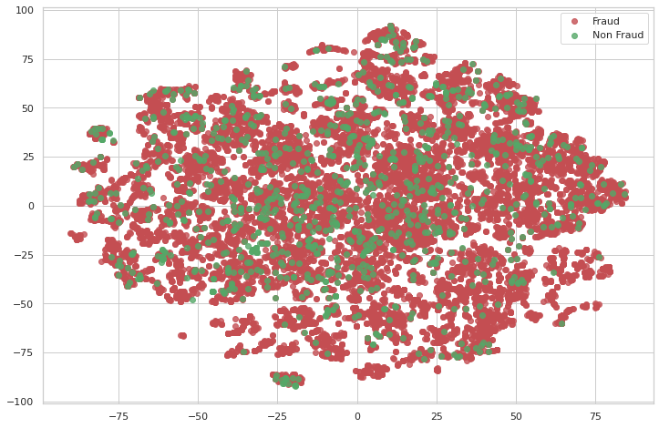
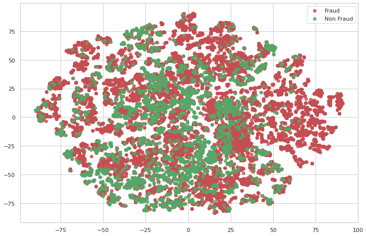
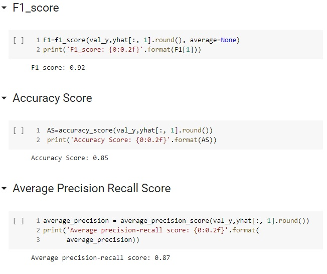
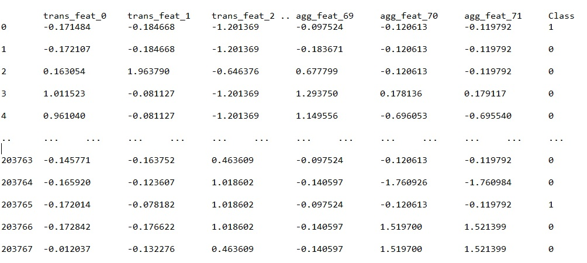
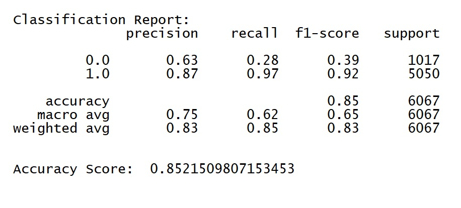

# Bitcoin Fraud detection System

*With the advancement of Bitcoin technology, money laundering has
it has been incentivized as a den of the Bitcoin blockchain, in which the user's identity hides behind a pseudonym known as an address. Despite the fact that this trait allows hiding in plain sight, the public ledger of The Bitcoin Blockchain provides more power to researchers and allows collective intelligence to fight money laundering and forensic analysis. This fascinating paradox arises in the force of Bitcoin technology. 
Machine learning techniques have achieved promising results in forensic analysis, in order to detect suspicious behavior on the Bitcoin blockchain.
This work presents a possible fraud detection system based on classical supervised learning together with unsupervised or semi-supervised ML, using different methods in a dataset recently published by elliptic.com derived from Bitcoin blockchain, to predict legal and illegal transactions in the net..*

## 1. Data

 We have used the Kaggle data in this link https://www.kaggle.com/ellipticco/elliptic-data-set which has 3 different files.
elliptic_txs_classes.csv
elliptic_txs_edgelist.csv
elliptic_txs_features.csv

## 2. Method

There are different types of recommendations that are used in practice today:

1. ** Use of a supervised ML system for a semi-supervised system: ** As the name implies, a simple Logistic Regression supervised ML model is used to predict a semi-supervised ML model.

2. ** Use of Label Propagation: ** Semi-supervised learning algorithms are different from supervised learning algorithms that can only learn from tagged training data. A popular approach to semi-supervised learning is to create a graph that connects examples in the training dataset and propagates known labels across the edges of the graph to label unlabeled examples. An example of this approach to semi-supervised learning is the label propagation algorithm for predictive classification modeling.**
 
3. ** Use of Label Spreading **: Another popular approach to semi-supervised learning that connects examples in the training dataset and propagates known labels through the edges of the graph to label unlabeled examples. An example of this approach to semi-supervised learning is the label spreading algorithm for classification predictive modeling.

4. ** Use of Encoders and Logistic Regression **: This approach makes use of autoencoders to learn the representation of the data then a simple linear classifier is trained to classify the dataset into respective classes.

5. ** KFold Usage *** This KFold is commonly used to make crosses
validation, but in this case we use this material for different purposes. The 0 K fold is the only data with known labels, we have to find the other folds and the last one is tested with the initial data

** WINNER: Use of encoders and logistic regression **
Because it offers the best results after checking the metrics

## 3. Data Cleaning 

[Data Cleaning Report](https://colab.research.google.com/drive/1KSaH2g3aMZWlv87AY-ryv6NVtpkd7yop?usp=sharing)

In our system there are many important columns to apply machine learning algorithms: It is very important to know the column that identifies the transaction, in our case although it is not in the same file, we have the "Class" column that identifies the transaction if it is Legal , Illegal or unknown.

We must create a DataFrame that groups the necessary columns for this, the best option is to use the features file and make a merge with the classes file (raw_features and raw_classes),
then we can already work with a single DataFrame

Because all the features in our file are already processed with normalization to maintain the confidentiality of the clients. It is not necessary to clean the columns that has already been done previously.
Of course, after we group the dataframes, if we must make some adjustments to keep the table operational. For example we have the fields id, time that I do not need for the ML model and txId that arose after the raw_features merge and therefore can also be eliminated.

There is also a policy that I followed to be able to verify the effectiveness of the ML model and that is that the Unknown Class will obtain a value either Legal or Illegal based on a random generator that will also maintain the ratio of 1/10 between Legal and Illegal transactions that we noticed in the analysis.

## 4. EDA

*In the EDA Analysis we were able to verify that generally illegal transactions also increase in the same proportion that the total of processed transactions increases.

## 5. Algorithms & Machine Learning

[ML Notebook](https://colab.research.google.com/drive/1XgOpuyY-9I1GpnKOKc4uTWlLz55QPmT-?usp=sharing)

I chose to work with Python [scikit] for my second part of the project when we used Logistic Regression, but I also used [keras] for the first part of my ML model when I used Sequential NN

It is important to know that we use Class (0) for Legal transactions and Class (1) for illegal ones.
I started with the simple model to see the effectiveness of ML supervised over ML semi supervised, then I tried the classic Label propagation and Label Spreading that we can find in the scikit learn library. Then I tried to use the Encoder with the Logistic Regression and finally the Kfold that is used for Cross Validation also serves to create a group of unknown fold versus a known one, the first one.

**WINNER: *Encoders and Logistic Regression*
Why? because you can check the Metrics

BEFORE APPLY MODEL

**************************************************
AFTER APPLIED MODEL

Metrics for Encoders an Logistic Regression

## 6. Dataset

Our data set is quite simple I tried different relationships between the training and testing data and the results were not impressive

Our dataset is pretty straightforward I tried different relationships between training and testing data and the results were not impressive.
I visualized the nature of fraud and non-fraud transactions using T-SNE. T-SNE (t-Distributed Stochastic Neighbor Embedding) is a dataset decomposition technique which reduced the dimentions of data and produces only top n components with maximum information. I performed min max scaling and finally the data came to  step with ML Sequential NN

## 7. Predictions

In the final predictions we could see a good performance in precision, recall, f1-score and accuracy. The confusion matrix had a very acceptable performance and the ROC and PR curves as well

## 8. Future Improvements

* In the future, I would like to spend more time on the behavior for the distribution of unknown classes, maybe we can find a better array to replace the unknown class with a series that optimally reflects the unknown behavior. Although I think the current one definitely meets the requirements

* Due to the RAM limitations in Google Colab, I had to train a small sample of the original data set, although this is precisely the advantage of being able to use this ML model that doesn't really need a large set to get good representations.

* I would like to also try the dataframe fast.ai since it serves to process and work with tabular data and maybe analyze more if we could find series that identify the data.

## 9. Credits

Thanks to Richard Ball for being an amazing Springboard mentor

